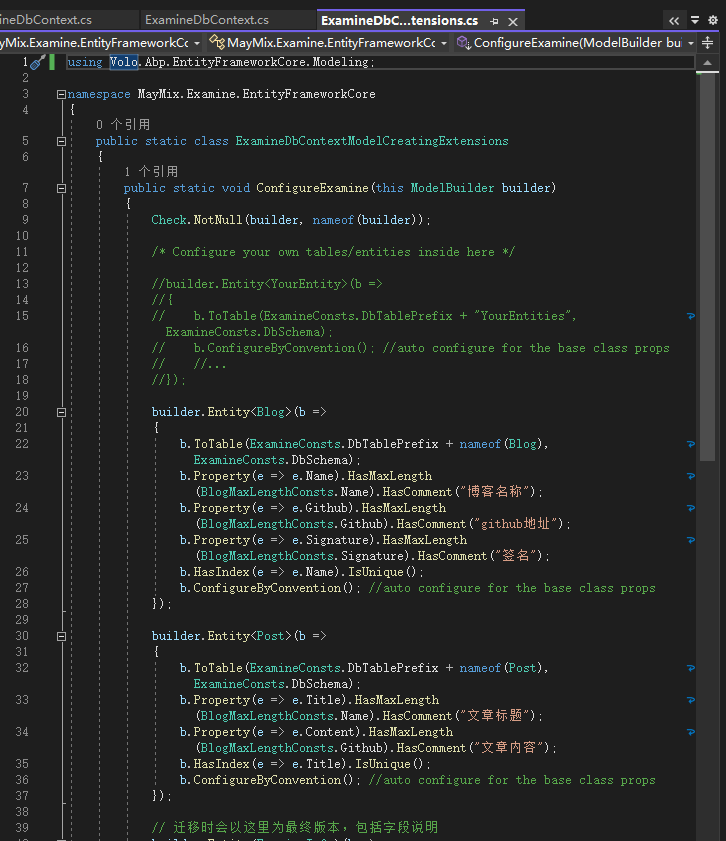
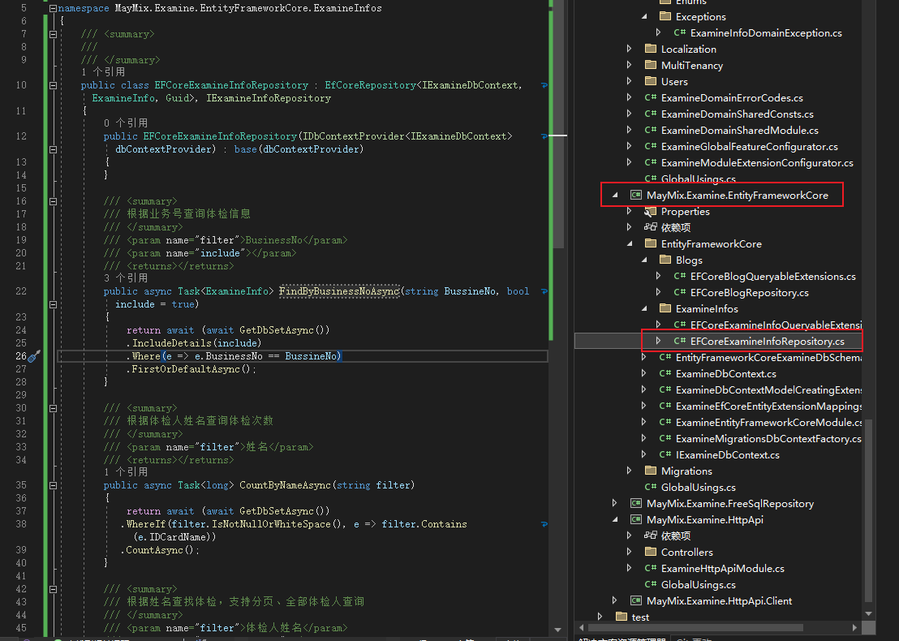

# 如何使用ABP Vnext Pro开发API流程

## 创建表实体映射
1. 设计表或根据现有表结构写映射类（聚合）Model。
    * 在 **Domain** 层新增对应服务文件夹，如体检服务 **Examineinfos** ；然后新增服务的 **Aggregates** 文件夹，用于存放服务的表映射实体；可以用在线工具将表的SQL生成C#实体类
    * 设置表、字段名称别名，Oracle默认转大写

2. 将表实体添加到DbContext中。
    > EF Core需要你将实体和 DbContext 建立关联.最简单的做法是在Acme.BookStore.EntityFrameworkCore项目的BookStoreDbContext类中添加DbSet属性.如下所示:
    ```C#
    public class BookStoreDbContext : AbpDbContext<BookStoreDbContext>
    {
        public DbSet<Book> Books { get; set; }
        //...
    }
    ```

3. 添加表到仓储接口类中；在 EF 下的 **IExamineDbContext.cs** 中增加如下示例代码：
    ```C#
    public interface IExamineDbContext : IEfCoreDbContext
    {
        DbSet<Blog> Blogs { get; set; }

        // 其他表`````
    }
    ```
4. 设置映射表的详细信息，包括表的别名、注释、主键、字符串长度等信息。
    > 这个不是必须，不设置也可以做数据迁移生成表；但没有注释、字段主键（前提是实体类中属性的特性也没有设置）等，所以这里还是建议去设置的，唯一让我苦恼的就是如果表字段多，加的时候会比较烦躁。

    如下图示例：
    

5. 在 **Domain** 对应服务下添加服务仓储接口，如体检服务则增加 **IExamineManager.cs** ，并增加可操作的方法函数。
6. Profile文件设置表实体和Dto实体的相互map（这里是要在的应用层设置，如果是应用层则在应用层的Profile文件中这是映射）.
7. 服务查询（各个方式查询根据业务而定）的EF 仓储层，用于基础的数据操作（非写入或更新）
    

8. 写完服务API后，报 **"An internal error occurred during your request!"** ，原因可以查看日志，我这里的原因有两个
    * 实体与实体的映射要对上；包括字段大小写一定要一直不然就抛异常错误，处理的方法就是要注意应用层、domain层的 **···Profile** 设置好使用的实体映射，示例 ***CreateMap<Blog, BlogDto>();**。

    * 一个是表的继承；正常官方、PRO框架推荐使用的分别是 AggregateRoot<Guid>、FullAuditedAggregateRoot<Guid>；但是这两者会有附带的属性，在迁移生成文件时就会带有这些属性到表中，这样可能会导致你查不到某个字段，或者字段大小写的原因在Oracle中查询要做特殊处理才可以查询等，所有如果要用这两个的话，就要注意这些属性对表是否有影响。**解决方法** ：使用Entity<Guid>，这个也是解决办法之一，而我就是使用的这个，因为我不想用附带的属性。