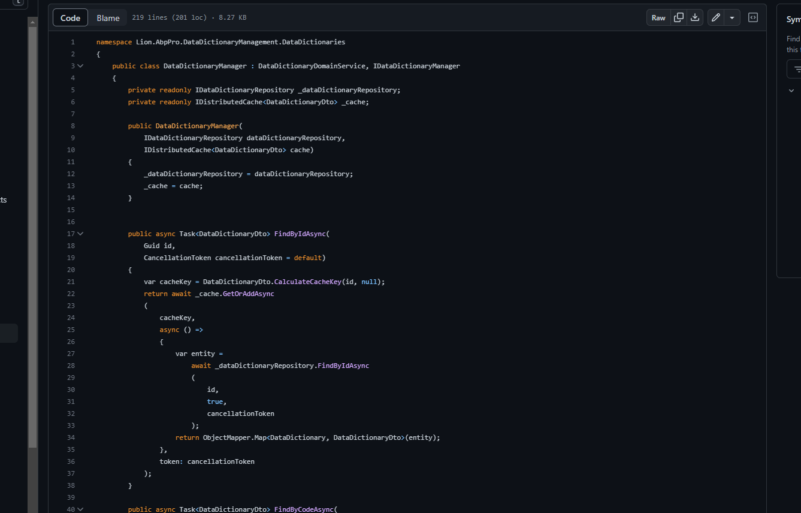
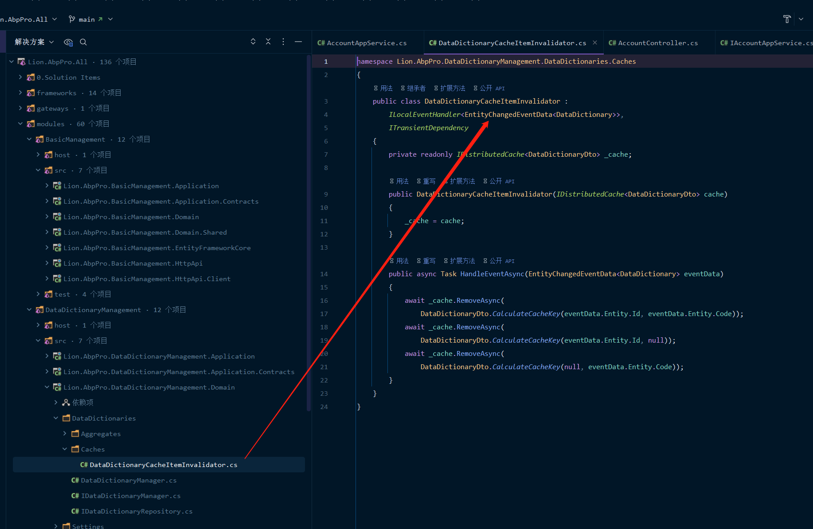

#### 背景说明
* 正常项目中要使用redis时，基本上都是直接从nuget中去获取包。但是在ABP中有配套的包，其封装了微软官方的缓存系统，使用也比较方便不需要再去做什么帮助类之类的（不过也可以自己实现帮助类但是能不能使用官方的来做就不清楚了）。

* ABP官方文档中的缓存文档对于微软官方出的redis包说明比较完善，具体也可参考，但是可能不是很好理解（对于我本人这个渣渣来说是这样的）。

#### 逻辑说明
> 正常情况下的逻辑思路是：按照ABP开发规则，从获取数据-判断redis中是否存在数据-不存在则从数据库获取数据，否则直接从redis获取并返回。

> 而上述的逻辑思路是在domain层的，也就是在Manager中去操作。

#### 示例代码

其中 **GetOrAddAsync** 是关键，且是我第一次遇到这么方便的帮助方法，有责获取没有则直接增加，其他都不用考虑，有没有感觉很简单很爽（也可能是我以前用的都比较麻烦吧，没用过其他感觉比较方便好用的）

#### 数据库与Redis缓存一致问题
> 在ABP中更新数据时，实体会有订阅事件，发现实体数据变化后会自动删除Redis中的缓存数据，下次查询时需要经过查询数据库，再缓存到Redis中。

如下源码中所示的订阅事件：

