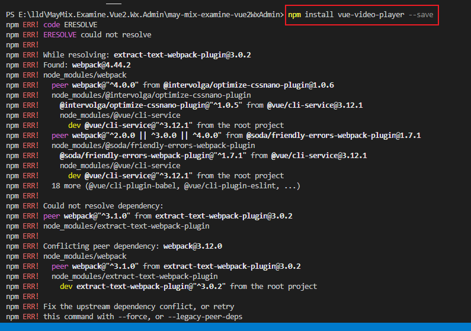

#### 背景/原因
* 在vue2项目中，使用到视频组件时，在使用npm安装对应组件报错，大概意思是版本冲突所致。参考了一些文章说是npm7.x.x以上的版本会在某些方面比较严格导致容易触发这种问题，npm7以下的不容易出现这类问题。

#### 错误重现
如下图：


#### 检查npm版本
如果版本过高就说明是这个原因导致，如若不是则超出了本文章的范围。
    ```
        npm -v
    ```
#### 解决方案
1. 在需要执行的指令后面都加上  **--legacy-per-deps**
    ```
        npm xxx --legacy-per-deps
    ```
2. 在指令后面都加上  **--force** ，如下
    ```
        npm xxx --force
    ```
3. 降低npm版本（谨慎，不推荐）
   * 但综合原因本人使用的是这个方案，具体看个人情况而定，不推荐盲目跟从。
   
   * 这里不推荐原因是因为，降低版本后，容易导致npm和node不相容，会出现很大问题。

   * 但是我的项目背景是vue2，所用的技术相对不怎么激进，所有考虑降低版本解决问题，但我的node版本确实最新的，所有可能会存在这个风险，但知道可能存在坑，也要去试一下。

   ```
        npm install vue-video-player --save // 版本可自行决断
   ```

#### 结束